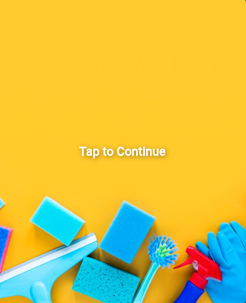
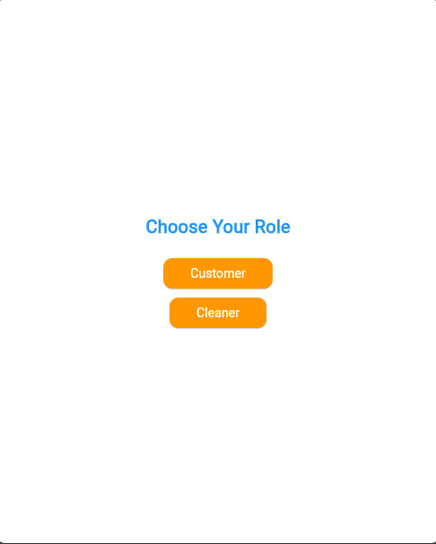
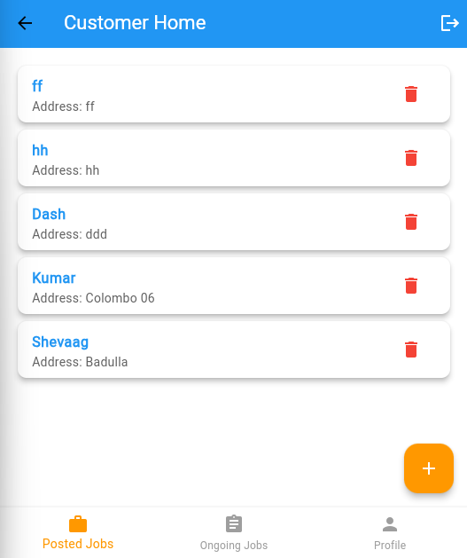
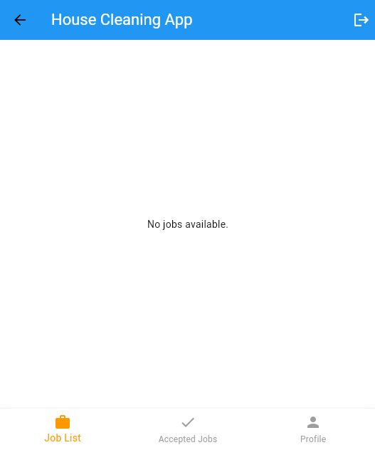

# 🧹 House Cleaning App

A feature-rich and intuitive mobile application that connects **customers** in need of cleaning services with **cleaners** offering them. Built with **Flutter** and powered by **Firebase**, the app ensures a seamless, secure, and modern solution for managing cleaning jobs.

---

## 📱 Features

### 👤 For Customers
- **Post Cleaning Jobs**: Create job postings with details such as address, house specifications, date, price, and room images.
- **Manage Jobs**: Track job status (Open, Accepted, Completed), view ongoing/completed jobs, and delete/cancel when necessary.
- **Submit Reviews**: Leave reviews and feedback for cleaners after job completion.
- **Update Profile**: Edit name, DOB, mobile number, emergency contact, preferred language, and profile picture.
- **Secure Authentication**: Sign up and log in safely with **Firebase Authentication**.

### 🧑‍🔧 For Cleaners
- **View Job List**: Access all open cleaning jobs with requirements, price, and location.
- **Accept Jobs**: Accept suitable jobs; job status updates to **“Accepted.”**
- **Manage Accepted Jobs**: Mark jobs as **“Finished”** once completed.
- **Update Profile**: Update name, DOB, experience, bio, and profile picture.
- **Secure Authentication**: Sign up and log in securely with **Firebase Authentication**.

---

## 🛠️ Tech Stack

- **Frontend**: [Flutter](https://flutter.dev/)
- **Backend**:
    - [Firebase Authentication](https://firebase.google.com/products/auth) – Secure login & signup
    - [Firebase Firestore](https://firebase.google.com/products/firestore) – Store jobs, profiles, and reviews
    - [Firebase Storage](https://firebase.google.com/products/storage) – Store profile and job-related images

---

## 🚀 Getting Started

### Prerequisites
- [Flutter SDK](https://docs.flutter.dev/get-started/install) installed
- Android Studio / VS Code with Flutter setup
- Firebase project set up ([Firebase Console](https://console.firebase.google.com/))

### Installation

# Clone the repository
git clone https://github.com/your-username/house-cleaning-app.git

# Navigate to project directory
cd house-cleaning-app

# Install dependencies
flutter pub get

# Run the app
flutter run

### Firebase Setup (Simple)

1. Go to [Firebase Console](https://console.firebase.google.com/) and create a new project.
2. Add an **Android app** to the project:
  - Download the `google-services.json` file.
  - Place it inside your project at `android/app/`.
3. (Optional) Add an **iOS app** if needed:
  - Download `GoogleService-Info.plist` and place it in `ios/Runner/`.
4. Enable **Authentication** (Email/Password) and **Firestore** in Firebase.
5. That’s it! The app will now connect to Firebase using your project configuration.

> ⚠️ Do **not** commit `google-services.json` or `GoogleService-Info.plist` to a public repository.

## 📷 Screenshots

**Starting Screen**  

**Role Selection**  

**Customer Dashboard**  

**Cleaner Dashboard**  

